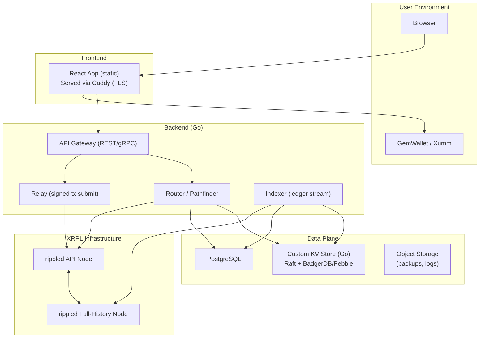

# XRPL-Native DEX — Architecture & Build Plan

**Scope:** A production-grade, self-hosted DEX front end for XRPL’s native order books + XLS-30 AMM. Go-first backend, React frontend, custom KV store (Redis-like) you own, zero-trust by default. Simple solutions over novelty; industry standards for security and ops.

---

## 1) System Overview



**Key properties**
- **Zero-trust**: server never sees user keys; client signs in wallet.
- **Stateless API**: cache & session data in your KV (replicated).
- **Self-hosted**: no cloud-managed DBs, queues, or SaaS in the core path.
- **Deterministic quotes**: route → hash → included in tx memo; TTL pins ledger freshness.

---

## 2) Design Principles (hard rules)

1. **Zero Trust**
   - No private keys on servers. Only accept **signed transaction blobs** (if you expose a relay).
   - All inter-service links use **mTLS** with your own CA; short-lived certs.

2. **Simple Solutions Preferred**
   - One process per responsibility. Avoid Kubernetes if not needed; use containerd + Nomad or a thin in-house scheduler.
   - Prefer Postgres over designing a new SQL database.

3. **Industry Standards**
   - TLS 1.3, HSTS, CSP, SRI, OWASP ASVS L2+ on the web app.
   - Structured logging (JSON), Prometheus metrics, minimal necessary syscaps on containers.

4. **Testability**
   - **Unit tests** for routing math, ledger decoding, kv TTL semantics.
   - **Golden files** for API JSON.
   - **Property tests** (fuzz) for parser/decoder boundaries.

5. **Reproducible Builds**
   - Static binaries, `FROM scratch` images, pinned digests.
   - SBOM emitted on build; image signing (cosign).

---

## 3) Services & What To Code

### 3.1 Indexer (Go)
**Purpose:** Subscribe to rippled websocket streams; normalize offers, pools, trades into DB and KV.

**Responsibilities**
- Connect to `rippled` (`transactions`, `ledger`, `book_offers`, AMM events).
- Build incremental **orderbook snapshots** (top N) for hot markets.
- Maintain **AMM pool state** (reserves, fees).
- Emit candles (1m/5m/1h) into Postgres/Timescale (optional).

**Package layout**
```
/cmd/indexer
/internal/ledgerws   // websocket client + subscriptions
/internal/normalize  // tx decoding → internal structs
/internal/store      // write DB + KV
```

**Skeleton (simplified)**
```go
// /internal/ledgerws/client.go
type Client struct {
    URL string
    Dial func(urlStr string, hdr http.Header) (Conn, *http.Response, error)
}
func (c *Client) Subscribe(ctx context.Context, subs []string) (<-chan Message, error) { /* ... */ }

// /cmd/indexer/main.go
func main() {
    ctx := context.Background()
    ws := ledgerws.New(os.Getenv("RIPPLED_WS"))
    msgs, _ := ws.Subscribe(ctx, []string{"transactions", "ledger"})
    for m := range msgs {
        switch m.Type {
        case "transaction":
            evt := normalize.Tx(m)
            store.WriteEvent(ctx, evt)
        case "ledgerClosed":
            store.RotateSnapshots(ctx, m.LedgerIndex)
        }
    }
}
```

**Unit test example**
```go
func TestDecodeOfferCreate(t *testing.T) {
    raw := loadFixture("offer_create_tx.json")
    evt := normalize.Tx(raw)
    if evt.Type != "OfferCreate" || evt.Price.IsZero() {
        t.Fatalf("bad decode: %#v", evt)
    }
}
```

---

### 3.2 Router / Pathfinder (Go)
**Purpose:** Given (from, to, amount, maxSlippage), compute best execution using:
- direct order books (quality tiers),
- AMM pools (constant product + fee),
- optional multi-hop (keep v1 single-hop for simplicity).

**API contract**
```go
type QuoteReq struct {
    From, To Asset
    Amount   Decimal
    MaxSlippageBps int
}
type QuoteResp struct {
    Route   Route // steps, markets, pool ids
    Out     Decimal
    Price   Decimal
    LedgerIndex uint32
    QuoteHash   [32]byte
    TTLLedgers  uint16
}
```

**Deterministic hash**
```go
func HashQuote(q QuoteResp) [32]byte {
    // canonical JSON (sorted keys) → blake2b-256
}
```

**Unit test example (math)**
```go
func TestAmmSwapMath(t *testing.T) {
    in := dec("100.0")
    x,y,fee := dec("10000"), dec("5000"), dec("0.30") // 30 bps
    out := amm.SimulateSwap(x,y,in,fee)
    require.InDelta(t, 48.7, out.Float64(), 0.01)
}
```

---

### 3.3 API Gateway (Go)
**Purpose:** Public REST/gRPC; no secrets; returns quotes; optional submit of **signed** tx blobs.

**Endpoints**
- `GET /v1/health`
- `GET /v1/orderbook?base=XRP&quote=USD.rXYZ…`
- `POST /v1/quote` → `QuoteResp`
- `POST /v1/submit` → `{ tx_hash }` (server verifies sig + quote hash → forwards to rippled)
- `GET /v1/pairs`, `GET /v1/pool/:id`

**Handler example**
```go
func (s *Server) PostQuote(w http.ResponseWriter, r *http.Request) {
    var req QuoteReq
    json.NewDecoder(r.Body).Decode(&req)
    q := s.router.Quote(r.Context(), req)
    q.QuoteHash = HashQuote(q)
    writeJSON(w, q, http.StatusOK)
}
```

**Submit validation snippet**
```go
func (s *Server) PostSubmit(w http.ResponseWriter, r *http.Request) {
    var in struct {
        SignedBlob string `json:"signed_tx_blob"`
        QuoteHash  string `json:"quote_hash"`
    }
    json.NewDecoder(r.Body).Decode(&in)

    // 1) parse & verify XRPL signature/public key
    tx, err := xrpl.ParseAndVerify(in.SignedBlob)
    if err != nil { http.Error(w,"bad sig",400); return }

    // 2) read memo -> must embed quote hash
    if !tx.HasMemo(in.QuoteHash) { http.Error(w,"hash mismatch",409); return }

    // 3) TTL check: LastLedgerSequence >= current && <= current+TTL
    if !validTTL(tx.LastLedgerSequence, s.ledgerIndex.Load()) {
        http.Error(w,"expired", 410); return
    }

    // 4) forward to rippled JSON-RPC submit
    hash, err := s.ripple.Submit(tx)
    writeJSON(w, map[string]string{"tx_hash":hash}, 200)
}
```

---

### 3.4 Custom KV Store (Go)
**Purpose:** Replace Redis for ephemeral data (quotes, rate limits, hot book cache) + pub/sub.

**Architecture**
- 3–5 nodes, **Raft** consensus.
- Storage engine: **BadgerDB** or **Pebble**.
- Ops: snapshots, log compaction, scrapeable metrics.

**Command set**
```
SET key value [ttl]
GET key
DEL key
INCR key
PUBLISH chan payload
SUBSCRIBE chan
```

**Internal interfaces**
```go
type Store interface {
    Set(k, v []byte, ttl time.Duration) error
    Get(k []byte) ([]byte, bool)
    Del(k []byte) error
    Incr(k []byte, delta int64) (int64, error)
    Publish(ch []byte, v []byte) error
    Subscribe(ctx context.Context, ch []byte) (<-chan []byte, error)
}
```

**TTL sweeper test**
```go
func TestTTLExpiration(t *testing.T) {
    s := newMemStore()
    _ = s.Set([]byte("q:abc"), []byte("route"), 50*time.Millisecond)
    time.Sleep(80*time.Millisecond)
    if _, ok := s.Get([]byte("q:abc")); ok {
        t.Fatal("expected expired")
    }
}
```

---

### 3.5 Frontend (React + TypeScript)
**Purpose:** Build/preview quotes, construct unsigned tx, request wallet signature, submit either directly (wallet) or via relay (signed blob).

**Rules**
- Strict **CSP**: no `unsafe-inline`/`eval`.
- Bundle separates **tx builder** into a small, audited module.
- SRI on third-party assets; ideally none in critical path.

**Tx build (example, pseudo-TS)**
```ts
import { buildPaymentTx } from "./xrplTx";

const signAndSubmit = async (quote: QuoteResp) => {
  // 1) Construct unsigned tx with memo(quote_hash) + LastLedgerSequence
  const tx = buildPaymentTx({
    from: account,
    to: quote.route.destination,
    amount: quote.out.toString(),
    lastLedgerSeq: quote.ledgerIndex + quote.ttlLedgers,
    memo: quote.quoteHash
  });

  // 2) Ask wallet to sign
  const signed = await window.gemwallet.signTransaction({ tx });

  // 3) Preferred: wallet submits directly (zero-trust stricter)
  await window.gemwallet.submit(signed);

  // 4) Optional: relay
  // await fetch("/v1/submit", { method:"POST", body: JSON.stringify({ signed_tx_blob: signed.tx_blob, quote_hash: quote.quoteHash }) })
};
```

---

## 4) Data Model (SQL)

```sql
-- Issuer metadata
CREATE TABLE issuers(
  address TEXT PRIMARY KEY,
  domain TEXT,
  name TEXT,
  logo_url TEXT,
  verified BOOLEAN DEFAULT FALSE,
  risk_flags JSONB DEFAULT '{}'::jsonb
);

-- Order book offers (denormalized for quick top-of-book)
CREATE TABLE offers(
  offer_id TEXT PRIMARY KEY,
  base_asset TEXT NOT NULL,
  quote_asset TEXT NOT NULL,
  price NUMERIC NOT NULL,
  qty NUMERIC NOT NULL,
  owner TEXT NOT NULL,
  ledger_index INT NOT NULL,
  last_seen TIMESTAMPTZ NOT NULL DEFAULT now()
);
CREATE INDEX ON offers(base_asset, quote_asset, price);

-- AMM pools
CREATE TABLE amm_pools(
  pool_id TEXT PRIMARY KEY,
  token_a TEXT NOT NULL,
  token_b TEXT NOT NULL,
  reserve_a NUMERIC NOT NULL,
  reserve_b NUMERIC NOT NULL,
  fee_bps INT NOT NULL,
  lp_supply NUMERIC NOT NULL,
  last_updated_ledger INT NOT NULL
);

-- Executed trades
CREATE TABLE trades(
  tx_hash TEXT PRIMARY KEY,
  pair TEXT NOT NULL,
  taker TEXT,
  maker TEXT,
  amount_in NUMERIC,
  amount_out NUMERIC,
  price NUMERIC,
  executed_at TIMESTAMPTZ NOT NULL,
  ledger_index INT NOT NULL,
  route JSONB NOT NULL
);
CREATE INDEX ON trades(pair, executed_at DESC);
```

---

## 5) Security Architecture

**Frontend**
- CSP: default-src 'none'; script-src 'self'; connect-src 'self' wallet origins; img-src 'self' data:; frame-ancestors 'none'.
- HSTS: max-age ≥ 1 year, includeSubDomains, preload.
- SameSite=strict cookies (if any). No localStorage for secrets.

**Backend**
- mTLS between services.
- Input validation + strict JSON schemas.
- Quote hash binding (memo) + `LastLedgerSequence` TTL.
- Rate-limit per IP + per account (`INCR` in KV).

**Nodes**
- `rippled` API isolated; relay is the only path allowed from public API to rippled.
- Drop Linux caps, read-only rootfs, seccomp default, non-root UID.

**Threat Model**
- **Phishing/tx swap:** mitigated by quote hash in memo + wallet UI.
- **Replay:** TTL and `LastLedgerSequence`.
- **Orderbook poisoning:** issuer verification & UI surfacing of issuer address/domain.
- **Infra compromise:** immutable images + mTLS + narrow egress.

---

## 6) Deployment & Ops

**Compute**
- 3 app nodes (API/Router/Relay), 2 data nodes (DB/KV), 2 XRPL nodes (API+history).
- WireGuard mesh; private RFC1918 network.

**Containers**
- Runtime: containerd. Orchestrator: Nomad (simple job specs) or your own scheduler.

**Caddy (TLS)**
- Auto-ACME, redirects, security headers.

**Observability**
- Prometheus scraping `/metrics`.
- Alerting: API P99 latency, rippled ledger lag, KV raft leader flaps, DB WAL backlog.

**Backups**
- Nightly DB snapshot to object storage (versioned, encrypted).
- KV snapshots hourly.
- Restore drills monthly.

---

## 7) Milestones

**M0:** rippled node + indexer streaming
**M1:** DB schema + router quoting
**M2:** Public API + wallet integration
**M3:** Relay, rate limit, monitoring
**M4:** Beta release, LP UI, issuer verification

---

## 8) Coding Guidelines
- 1 func ≤ 60 lines.
- No global vars; use dependency injection.
- Tests for every exported func.
- No panics in lib code.
- Use `context.Context` for cancellation.
- Prefer pure functions, simple loops, no reflection.
- Log in structured JSON.
- Avoid concurrency until required; measure first.

---

## 9) Summary
- XRPL native = no contracts, safer base.
- You code all infra in Go.
- Custom KV replaces Redis.
- Zero trust, reproducible builds, and full test coverage ensure durability.
- Start small, make it boring, harden it over time.

